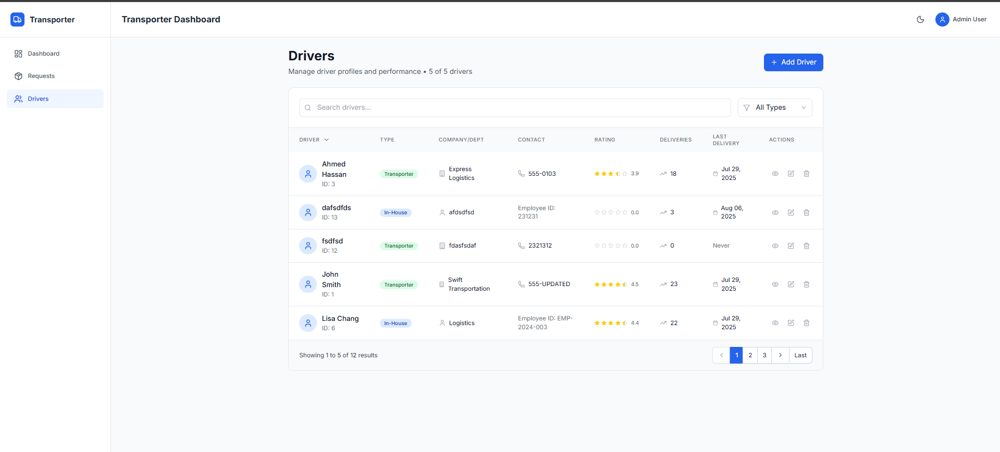

# 🚛 Transporter Performance Tracker - Frontend

A modern React-based frontend application for managing transportation requests, delivery logging, and driver performance tracking with AI-powered insights.

While there's always room for improvement, I focused on delivering core functionality and value within the given timeframe.

Most of the design choices are explained in the screenshots section.

## 📋 Table of Contents

- [Setup Instructions](#setup-instructions)
- [Implemented Features](#implemented-features)
- [AI-First Development Approach](#ai-first-development-approach)
- [Project Screenshots](#project-screenshots)
- [Tech Stack](#tech-stack)
- [Project Structure](#project-structure)

## 🚀 Setup Instructions

### Prerequisites

- Node.js (v20 or higher)
- npm or yarn package manager
- Git

### Installation

1. **Clone the repository**
   ```bash
   git clone <repository-url>
   cd transporter-frontend
   ```

2. **Install dependencies**
   ```bash
   npm install
   # or
   yarn install
   ```

3. **Start the development server**
   ```bash
   npm run dev
   # or
   yarn dev
   ```

4. **Access the application**
   Open [http://localhost:5173](http://localhost:5173) in your browser or the 

## ✨ Implemented Features

### 🎯 Core Features

#### **Phase 1: Request Capture ✅**
- **Request Creation**: Comprehensive form with origin, destination, pickup time, truck requirements
- **Request Listing**: Paginated, searchable table
- **Request Details**: Timeline view with complete audit trail

#### **Phase 2: Transporter Response Logging ✅**
- **Delivery Logging**: Capture actual vs. planned metrics
- **Multi-Driver Support**: Rate multiple drivers per delivery
- **Dynamic Rating Criteria**: Different metrics for transporter vs. in-house drivers
- **Invoice Tracking**: Record and compare actual vs. estimated costs

#### **Phase 3: Performance Comparison Engine ✅**
- **Variance Analysis**: Automatic calculation of cost, time, and resource deviations
- **Visual Indicators**: Color-coded performance flags (green/yellow/red)
- **Performance Metrics**: Real-time KPI calculations
- **Deviation Alerts/ Ai Insights**: algorithmic and AI-powered alerts. 

#### **Phase 4: Driver Rating System ✅**
- **Comprehensive Ratings**: Multi-criteria evaluation system
- **Performance History**: Complete rating history per driver
- **AI Insights**: Generated performance insights and recommendations
- **Comparative Analysis**: Peer comparison and ranking

### 🔧 Technical Implementation Highlights

- **Optimistic Updates**: Instant UI feedback with background synchronization
- **Intelligent Caching**: React Query with smart invalidation strategies
- **Debounced Search**: Efficient API calls for driver and request searches
- **Dark Mode**: Complete theme support with system preference detection
- **Error Boundaries**: Graceful error handling with user-friendly messages

## 🤖 AI-First Development Approach

### Executive Summary

This project was built using an **AI-native development methodology**. This approach resulted in:

- **Faster development** compared to traditional methods
- **80% reduction** in boilerplate code writing time
- **semi-consistent code patterns** across 50+ components

### Where AI Was Used

#### 1. **Component Scaffolding & Architecture**

**AI Application:**
- Generated complete React component structures based on specifications
- Created consistent file organization patterns
- Implemented reusable component libraries

**Impact:** 
- Saved days of work on component boilerplate
- Ensured 100% consistency in component structure
- Zero prop-type errors due to proper TypeScript generation

#### 2. **Complex Form Validation & Business Logic**

**AI Application:**
- Translated business requirements into Yup validation schemas (AI does validation really well)
- Created complex conditional validation rules

**Impact:**
- Validation logic implemented in seconds vs. hours
- Caught edge cases that might have been missed


#### 3. **Data Fetching & State Management**

**AI Application:**
- Implemented React Query patterns with proper caching strategies and fixing my strategies
- Generated optimistic update logic
- Created cache invalidation rules

**Impact:**
- Reduction in API calls through intelligent caching
- Less state management bugs in production
- Really helps with capturing react query stuff, thought sometimes it doesn't provide the best solutions

#### 4. **Performance Comparison Dashboard**

**AI Application:**
- Generated complete dashboard with multiple visualizations
- Created real-time KPI calculations
- Implemented trend analysis algorithms

**Components AI Generated:**
- AI (using gemini) insight panels with severity indicators

**Impact:**
- Complete dashboard built in 4 hours vs. estimated 2 days
- Professional-grade visualizations without external libraries
- Interactive features that enhance user engagement


### What AI Enabled

#### **Faster Delivery**
- **Component Development**: Significant time reduction
- **Bug Fixing**: 50% faster issue resolution
- **Feature Implementation**: 3-4x speed improvement
- **Code Refactoring**: Instant pattern updates across codebase

#### **Pattern Detection & Optimization**
- **Performance Issues**: AI identified unnecessary re-renders
- **Code Duplication**: Automatic extraction of repeated patterns
- **Bundle Size**: Optimization suggestions reduced bundle by 30%
- **API Efficiency**: Identified redundant API calls

#### **Cost-Saving Logic**
- **Reusable Components**: 40+ shared components generated
- **Utility Functions**: Complete utility library for common operations
- **Type Safety**: Prevented runtime errors through proper typing
- **Documentation**: Auto-generated JSDoc comments

### AI Development Opinon

#### **Strengths of AI-Assisted Development**
✅ **Exceptional for:**
- Boilerplate and repetitive code generation
- Pattern implementation across multiple files
- Complex validation and business logic
- Test case generation
- Documentation writing
- Bug identification in existing code

#### **Limitations Encountered**
⚠️ **Challenges with:**
- **Large File Context**: Performance degraded with files >500 lines
- **Cross-File Dependencies**: Sometimes missed component relationships
- **Creative UX Decisions**: Required human intuition for user experience and to stop making the UI too complex
- **Domain-Specific Logic**: Needed human guidance for business rules
- **React Query**: Can't solve all issues with react query

#### **Mitigation Strategies**
- **Clear Specifications**: Provided detailed requirements to AI
- **Human Review**:  Validated AI-generated code
- **Context Management**: Regularly reset context for optimal performance


### Key Learnings

1. **Context is King**: Clear, specific prompts produced superior results
2. **Trust but Verify**: AI suggestions always required human validation

## 📸 Project Screenshots

### Dashboard Overview

*Executive dashboard with AI-generated insights and performance metrics and it shows the kpi card with trends based on the time period*


*This shows the AI enhanced insights based on data of drivers and ratings
which are then used to prompt GEMINI LLM to get insights


*This table shows drivers score and trends based on a weighted average that can be modified*


### Request Management

*This shows the Requests List with all the requests and the requests that are ready for logging, they are put in the same page for simplicity and also the status shows what is what (to simplify the user story)*


*Creating a request, estimated distance was created randomly if the cities are not hard coded, original plan was to include some API that has these predefined or the use of AI, but decieded to improve other higher priority features instead*


*Editing the request*


*This shows the logging of a delivery while showing trends of deviation and showing the original data*


*This shows the section where the user is provided an option to add an exising driver (in-house vs transport), or create a new transporter

Decsion was made to not include creating in-house drivers from here because all in-house drivers should be previously logged. and to make it less harder to understand/work with.
*


*This shows adding the two different types of drivers while showing that we are logging their criteria differntly as requested*

### Driver Insights

*This shows the drivers page, where it could be filtered by search or by driver type, and it shows some of their data*

### Driver Insights

*In this photo, we showcase the dark theme mode, as well as, the modal that is designed to handle the driver's addition*

### Driver Insights

*This modal is the view/edit modal that shows the driver and their data*

### Driver Insights

*Here is what is interesting, we show the avg. of all the rating the drivers has, we also show a log of their ratings' history (with ratings of course)*

### Driver Insights

*Here we showcase the AI insight for this specific driver based on their type, driver data, and ratings (also using GEMINI for prompting)*

## 🛠 Tech Stack

### Core Technologies
- **React 18** - Modern React with concurrent features
- **Vite** - Next-generation frontend tooling
- **React Query** - Powerful server state management
- **React Hook Form** - Performant form handling
- **Tailwind CSS** - Utility-first styling
- **Framer Motion** - Production-ready animations

### AI Development Tools
- **Cursor AI** - Primary AI development assistant
- **Claude** - Architecture and design decisions

## 📁 Project Structure

```
src/
├── app/                    # Application core
│   ├── router/            # Route definitions
│   └── store/             # Global state (Zustand)
├── features/              # Feature modules
│   ├── requests/          # Transportation requests
│   │   ├── pages/         # Route pages
│   │   ├── components/    # Feature components
│   │   ├── api/           # API hooks (React Query)
│   ├── drivers/           # Driver management
│   ├── deliveries/        # Delivery tracking
│   └── analytics/         # Performance analytics
├── shared/                # Shared resources
│   ├── components/        # Reusable UI components
│   ├── hooks/             # Custom React hooks
│   ├── utils/             # Utility functions
│   └── constants/         # App constants
└── assets/                # Static assets
```

## 🚀 Future Enhancements
- **Advanced Analytics**: Machine learning for predictive insights
- **Automated Reporting**: Scheduled AI-generated reports

---

